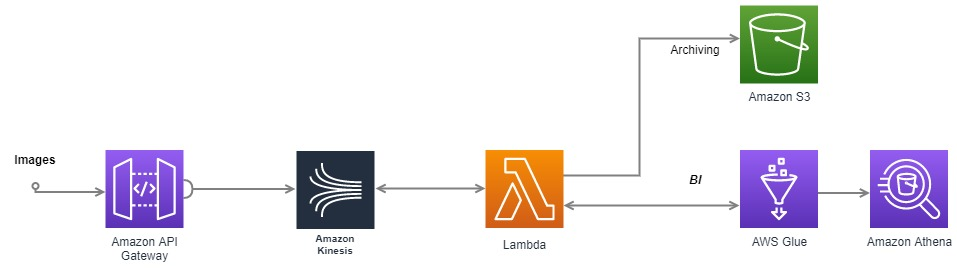

The graph is designed on website draw.io.

Images are uploaded through API, then are sent to Kinesis, to be consumed later on by application or function on Lamda. All processed imaged would be archived in S3 storage. For BI part, we use AWS Glue and athena.